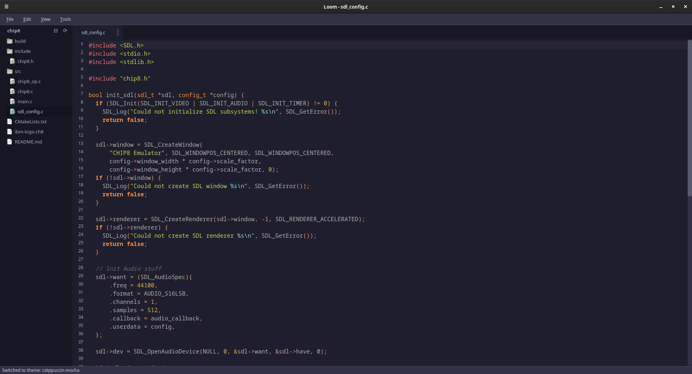

<div align="center">
  

# Loom

**A fast, minimal, and customizable text editor.**

Built with C++ and Qt, featuring Lua scripting for configuration and plugins

[]()
[]()
[]()
[]()
[]()



</div>

## Features

- **Lightweight & Fast** - Minimal resource usage with responsive text editing
- **Multiple Themes** - Choose from Gruvbox, Dracula, and Catppuccin Mocha themes
- **Theme Switching** - Toggle between themes with `Ctrl+Shift+T` or Tools menu
- **Syntax Highlighting** - Support for multiple programming languages
- **Multi-Tab Interface** - Manage multiple files with tabbed interface
- **File Tree Viewer** - Navigate project directories with a collapsible file tree panel
- **Project Support** - Open entire project directories and navigate files easily
- **Customizable Keybindings** - Configure shortcuts to match your workflow
- **Line Numbers** - Optional line number display with relative numbering
- **Find & Replace** - Built-in search and replace functionality

### Plugin System
- **Extensible Architecture** - Lua-based plugin system for unlimited customization
- **Theme Switcher Plugin** - Easy theme switching with keyboard shortcuts and menu integration
- **AutoSave Plugin** - Automatic file saving with configurable intervals
- **AutoFormat Plugin** - Code formatting with external formatters (clang-format, prettier, black, stylua, rustfmt)
- **Plugin Management** - Easy loading, configuration, error recovery, and dynamic menu updates

> **⚠️ <span style="color:red">IMPORTANT:</span>** The AutoFormat plugin requires external formatting tools to be installed on your system! Run `./scripts/install_formatters.sh` to install all required formatters automatically.

### Configuration System
- **Lua-Based Config** - Powerful configuration through `config/config.lua`
- **Runtime Configuration** - Change settings without restarting the editor
- **Plugin Configuration** - Individual plugin settings and toggles
- **Keybinding Customization** - Define custom keyboard shortcuts
- **Editor Settings** - Font, theme, tab width, line numbers, and more

## Quick Start

### Prerequisites

Before building Loom, ensure you have the following installed:

- **CMake** 3.16 or higher
- **Qt5** development libraries
- **Lua** 5.3 or 5.4 development libraries
- **C++17** compatible compiler (GCC, Clang, or MSVC)

### Installation

#### Linux (Ubuntu/Debian) - DEB Package (Recommended)
```bash
# Download the latest DEB package from GitHub releases
wget https://github.com/dexter-xd/loom/releases/download/beta_1.1.0/loom_1.1.0_amd64.deb

# Install the package
sudo dpkg -i loom_1.1.0_amd64.deb
sudo apt-get install -f  # Fix any dependency issues

# Run Loom
loom
```

#### Linux (Ubuntu/Debian) - Build from Source
```bash
# Install dependencies
sudo apt update
sudo apt install cmake qtbase5-dev liblua5.4-dev build-essential

# Clone the repository
git clone https://github.com/dexter-xd/loom.git
cd loom

# Build using the provided script
chmod +x scripts/build_release.sh
./scripts/build_release.sh

# Run Loom
./scripts/run_loom.sh
```

#### Linux (Fedora/RHEL)
```bash
# Install dependencies
sudo dnf install cmake qt5-qtbase-devel lua-devel gcc-c++

# Clone and build
git clone https://github.com/dexter-xd/loom.git
cd loom
chmod +x scripts/build_release.sh
./scripts/build_release.sh
```

#### macOS
```bash
# Install dependencies with Homebrew
brew install cmake qt@5 lua

# Clone and build
git clone https://github.com/dexter-xd/loom.git
cd loom
chmod +x scripts/build_release.sh
./scripts/build_release.sh
```

### Build Options

#### Using Build Scripts (Recommended)

**Release Build (Optimized)**
```bash
./scripts/build_release.sh
```

**Debug Build (Development)**
```bash
./scripts/build_debug.sh
```

**Running Loom**
```bash
# Recommended way (suppresses Qt warnings)
./scripts/run_loom.sh [optional-file-path]

# Direct execution
./build/loom [optional-file-path]
```

#### Manual Build

```bash
# Create build directory
mkdir build && cd build

# Configure with CMake
cmake -DCMAKE_BUILD_TYPE=Release ..

# Build the project
cmake --build . -j$(nproc)

# Run the editor
./loom
```

## Important: External Formatters for AutoFormat Plugin

**The AutoFormat plugin requires external formatting tools to be installed on your system.** The plugin uses these external formatters to provide professional code formatting:

- **clang-format** - For C/C++ code formatting
- **prettier** - For JavaScript, TypeScript, JSON, HTML, CSS formatting  
- **black** - For Python code formatting
- **stylua** - For Lua code formatting
- **rustfmt** - For Rust code formatting (comes with Rust toolchain)

### Quick Formatter Installation

I provide an automated installation script for all required formatters:

```bash
# Make the script executable and run it
chmod +x scripts/install_formatters.sh
./scripts/install_formatters.sh
```

The script will:
- Detect your operating system (Linux, macOS)
- Install system packages (clang-format, Node.js, Python)
- Install npm packages (prettier)
- Install Python packages (black)
- Install Rust packages (stylua) if Cargo is available
- Show you which formatters are installed and which are missing

### Manual Installation

If you prefer manual installation:

```bash
# Ubuntu/Debian
sudo apt install clang-format nodejs npm python3-pip
npm install -g prettier
pip3 install black
cargo install stylua  # if you have Rust installed

# macOS (with Homebrew)
brew install clang-format node python
npm install -g prettier
pip3 install black
cargo install stylua  # if you have Rust installed

# Fedora/RHEL
sudo dnf install clang-tools-extra nodejs npm python3-pip
npm install -g prettier
pip3 install black
cargo install stylua  # if you have Rust installed
```

**Note:** The AutoFormat plugin will automatically detect which formatters are available and only format files for languages where the corresponding formatter is installed.

## Configuration System

Loom uses a powerful Lua-based configuration system that allows you to customize every aspect of the editor.

### Configuration Structure

```
config/
└── config.lua          # Main configuration file
plugins/
├── autoformat.lua      # Auto-formatting plugin
└── autosave.lua       # Auto-save plugin
```

### Main Configuration (`config/config.lua`)

The main configuration file controls editor behavior, appearance, and keybindings:

```lua
config = {
    -- Editor Settings
    editor = {
        font_family = "JetBrains Mono",
        font_size = 12,
        tab_width = 8,
        show_line_numbers = true,
        word_wrap = true,
        auto_indent = true,
        highlight_current_line = true
    },
    
    -- Theme Settings (NEW in v1.1.0)
    theme = {
        name = "gruvbox" -- Options: "gruvbox", "dracula", "catppuccin-mocha"
    },
    
    -- Window Settings
    window = {
        width = 1224,
        height = 768,
        remember_size = true,
        remember_position = true
    },
    
    -- Keybindings (Enhanced in v1.1.0)
    keybindings = {
        ["Ctrl+S"] = "save_file",
        ["Ctrl+O"] = "open_file",
        ["Ctrl+N"] = "new_file",
        ["Ctrl+T"] = "new_tab",
        ["Ctrl+W"] = "close_file",
        ["Ctrl+Q"] = "quit_application",
        ["F11"] = "toggle_fullscreen",
        ["F12"] = "toggle_file_tree",         -- File tree panel toggle
        ["Ctrl+Shift+T"] = "toggle_theme",    -- Theme switching
        ["Ctrl+Shift+F"] = "format_document", -- Document formatting
        -- Add your custom keybindings here
    },
    
    -- Plugin Configuration (Enhanced in v1.1.0)
    plugins = {
        enabled = true,
        auto_load = true,
        error_recovery = true,
        
        -- Individual plugin settings
        theme_switcher = {
            enabled = true,
            auto_load = true
        },
        
        autosave = {
            enabled = false,
            interval = 10, -- seconds
            save_on_focus_lost = false
        },
        
        autoformat = {
            enabled = true,
            auto_load = true,
            format_on_save = true,
            use_external_formatters = true
        }
    }
}
```

### Configuration Functions

The configuration system provides helper functions:

```lua
-- Get configuration value with fallback
local font_size = get_config("editor.font_size", 12)

-- Set configuration value
set_config("editor.font_size", 14)
```

## Plugin System

Loom features a robust plugin system powered by Lua scripting. Plugins can extend functionality, add new features, and integrate with external tools.

### Available Plugins

#### Theme Switcher Plugin (`plugins/theme_switcher.lua`) - NEW in v1.1.0

Provides easy theme switching functionality with multiple beautiful themes.

**Features:**
- Toggle between available themes with `Ctrl+Shift+T`
- Access via Tools → Toggle Theme menu
- Supports three themes: Gruvbox, Dracula, and Catppuccin Mocha
- Automatic theme cycling (wraps around to first theme)
- Config updates when theme changes
- Plugin metadata with version tracking

**Available Themes:**
- **Gruvbox**: Warm, retro groove colors with excellent contrast
- **Dracula**: Dark theme with vibrant purple and pink accents
- **Catppuccin Mocha**: Soothing pastel colors on a dark background

**Configuration:**
```lua
plugins = {
    theme_switcher = {
        enabled = true,     -- Enable/disable theme switcher
        auto_load = true    -- Load plugin on startup
    }
}

-- Set default theme
theme = {
    name = "gruvbox"  -- Options: "gruvbox", "dracula", "catppuccin-mocha"
}
```

**Usage:**
- **Keyboard**: Press `Ctrl+Shift+T` to cycle through themes
- **Menu**: Go to Tools → Toggle Theme
- **Config**: Set default theme in `config.lua`
- **Lua Console**: Call `toggle_theme()` or `switch_to_theme("theme_name")`

#### AutoSave Plugin (`plugins/autosave.lua`)

Automatically saves your files at regular intervals to prevent data loss.

**Features:**
- Configurable save interval (default: 30 seconds)
- Smart saving (only saves when content changes)
- Status bar integration
- Save counter and timestamps

**Configuration:**
```lua
plugins = {
    autosave = {
        enabled = true,           -- Enable/disable autosave
        interval = 30,           -- Save interval in seconds
        save_on_focus_lost = false, -- Save when window loses focus
        backup_files = false     -- Create backup files
    }
}
```

**Usage:**
- Automatically runs in the background when enabled
- View status: Check status bar for save count and last save time
- Toggle: Use Lua console to call `autosave.toggle()`

#### AutoFormat Plugin (`plugins/autoformat.lua`)

Automatically formats your code using external formatters for consistent code style.

**Supported Languages & Formatters:**
- **C/C++**: `clang-format` (Google style)
- **JavaScript/TypeScript**: `prettier`
- **JSON**: `prettier`
- **HTML/CSS**: `prettier`
- **Lua**: `stylua`
- **Python**: `black`
- **Rust**: `rustfmt`

**Features:**
- Format on save (configurable)
- Manual formatting command
- External formatter integration
- Language auto-detection
- Cursor position preservation

**Configuration:**
```lua
plugins = {
    autoformat = {
        enabled = true,                    -- Enable/disable plugin
        auto_load = true,                  -- Load plugin on startup
        format_on_save = true,            -- Format when saving files
        use_external_formatters = true    -- Use external tools
    }
}
```

**Required External Tools:**
```bash
# Install formatters as needed
npm install -g prettier          # JavaScript/TypeScript/JSON/HTML/CSS
pip install black               # Python
cargo install stylua           # Lua
# clang-format usually comes with clang
# rustfmt comes with Rust toolchain
```

**Usage:**
- **Keyboard**: Press `Ctrl+Shift+F` to format current document
- **Menu**: Go to Tools → Format Document
- **Automatic**: Enable `format_on_save` in configuration
- **Lua Console**: Call `autoformat.format_document()`
- **Status**: Use `autoformat.show_status()` to see available formatters

### Plugin Management

#### Loading Plugins

Plugins are automatically loaded from the `plugins/` directory on startup. The plugin manager:

- Scans for `.lua` files in the plugins directory
- Validates plugin structure
- Initializes plugins with error recovery
- Provides status reporting

#### Plugin Configuration

Each plugin can be configured in the main `config.lua` file:

```lua
plugins = {
    enabled = true,        -- Global plugin system toggle
    auto_load = true,      -- Load plugins on startup
    error_recovery = true, -- Continue loading other plugins if one fails
    
    -- Plugin-specific settings
    plugin_name = {
        enabled = true,
        -- plugin-specific options
    }
}
```

#### Creating Custom Plugins

Create a new `.lua` file in the `plugins/` directory:

```lua
-- my_plugin.lua
my_plugin = {
    name = "my_plugin",
    version = "1.0",
    description = "My custom plugin",
    enabled = true
}

-- Initialize plugin
function my_plugin.initialize()
    print("My plugin initialized!")
    
    -- Register event handlers
    events.connect("file_saved", "my_plugin.on_file_saved")
end

-- Cleanup plugin
function my_plugin.cleanup()
    print("My plugin cleaned up!")
end

-- Event handler
function my_plugin.on_file_saved(event_name, file_path)
    print("File saved: " .. file_path)
end

-- Make event handler globally accessible
_G["my_plugin.on_file_saved"] = my_plugin.on_file_saved

print("My plugin loaded!")
```

## Theming - Enhanced in v1.1.0

Loom now supports multiple beautiful themes that you can switch between easily.

### Available Themes

#### Gruvbox (Default)
A warm, retro groove color scheme providing comfortable dark theme optimized for long coding sessions.
- **Background**: Dark variants (#282828, #1d2021, #3c3836)
- **Foreground**: Light variants (#ebdbb2, #fbf1c7, #d5c4a1)
- **Accents**: Red, Green, Yellow, Blue, Purple, Aqua, Orange

#### Dracula
A dark theme with vibrant purple and pink accents, popular among developers.
- **Background**: Dark purple (#282a36, #44475a)
- **Foreground**: Light variants (#f8f8f2, #6272a4)
- **Accents**: Purple, Pink, Green, Orange, Red, Yellow

#### Catppuccin Mocha
A soothing pastel theme with warm colors on a dark background.
- **Background**: Dark variants (#1e1e2e, #313244, #45475a)
- **Foreground**: Light variants (#cdd6f4, #bac2de)
- **Accents**: Soft pastels in various hues

### Theme Switching

**Change themes instantly without restarting:**

1. **Keyboard Shortcut**: Press `Ctrl+Shift+T` to cycle through themes
2. **Tools Menu**: Go to Tools → Toggle Theme
3. **Configuration**: Set default theme in `config.lua`:
   ```lua
   theme = {
       name = "gruvbox"  -- Options: "gruvbox", "dracula", "catppuccin-mocha"
   }
   ```
4. **Lua Console**: Call theme functions directly:
   ```lua
   toggle_theme()                    -- Cycle to next theme
   switch_to_theme("dracula")       -- Switch to specific theme
   get_current_theme()              -- Get current theme name
   list_themes()                    -- List available themes
   ```

### Theme Customization

Themes are defined in `themes/*.qss` files using Qt stylesheets. You can customize:

- Color values for any theme
- Font settings (though fonts are controlled by configuration)
- UI element styling
- Tab appearance
- Scrollbar design
- Syntax highlighting colors

## Keybindings

### Default Keybindings

| Shortcut | Action |
|----------|--------|
| `Ctrl+N` | New file |
| `Ctrl+O` | Open file |
| `Ctrl+S` | Save file |
| `Ctrl+T` | New tab |
| `Ctrl+W` | Close current file |
| `Ctrl+Q` | Quit application |
| `Ctrl+Z` | Undo |
| `Ctrl+Y` | Redo |
| `Ctrl+C` | Copy |
| `Ctrl+V` | Paste |
| `Ctrl+X` | Cut |
| `Ctrl+A` | Select all |
| `Ctrl+F` | Find |
| `Ctrl+H` | Replace |
| `F11` | Toggle fullscreen |
| `F12` | Toggle file tree |
| `Ctrl+L` | Set language |
| `Ctrl+Shift+L` | Redetect language |
| `Ctrl+Shift+T` | Toggle theme |
| `Ctrl+Shift+F` | Format document |

### Custom Keybindings

Add custom keybindings in `config/config.lua`:

```lua
keybindings = {
    ["Ctrl+Shift+T"] = "toggle_theme",     -- Theme switching
    ["Ctrl+Shift+F"] = "format_document",  -- Document formatting
    ["Ctrl+/"] = "toggle_comment",         -- Comment toggling
    ["Ctrl+D"] = "duplicate_line",         -- Line duplication
    -- Add your custom bindings here
}
```

## Development

### Debug Build

For development and debugging:

```bash
./scripts/build_debug.sh
```

Debug builds include:
- Debug symbols for debugging
- Verbose logging output
- Development-friendly error messages
- Unoptimized code for easier debugging

### Logging

Loom includes a comprehensive logging system:

```cpp
// In C++ code
LOG_ERROR("Error message");
DEBUG_LOG("Debug message");

// In Lua plugins
editor.debug_log("Debug message from Lua")
```

### Testing

Test your changes with the provided sample files in `test_files/`:

```bash
# Test with different file types
./scripts/run_loom.sh test_files/sample.cpp
./scripts/run_loom.sh test_files/sample.js
./scripts/run_loom.sh test_files/sample.py
./scripts/run_loom.sh test_files/sample.lua
```

### Creating DEB Packages

For maintainers and contributors who want to create distribution packages:

```bash
# Build, test, and package everything in one command
./scripts/package.sh
```

This single script will:
- Build the optimized release binary
- Create the DEB package with proper dependencies
- Run comprehensive tests to verify package integrity
- Display detailed package information and statistics
- Provide installation instructions

The DEB package includes:
- Compiled binary (`/usr/bin/loom`)
- Configuration files (`/usr/share/loom/config/`)
- Plugin system (`/usr/share/loom/plugins/`)
- Themes (`/usr/share/loom/themes/`)
- Desktop integration (`.desktop` file and icon)
- Proper dependency management

## Contributing

I welcome contributions! Here's how you can help:

1. **Fork** the repository
2. **Create** a feature branch (`git checkout -b feature/amazing-feature`)
3. **Commit** your changes (`git commit -m 'Add amazing feature'`)
4. **Push** to the branch (`git push origin feature/amazing-feature`)
5. **Open** a Pull Request

### Contribution Guidelines

- Follow the existing code style
- Add tests for new features
- Update documentation as needed
- Ensure all builds pass
- Test on multiple platforms when possible

## License

This project is licensed under the MIT License - see the [LICENSE](LICENSE) file for details.

## Acknowledgments

- **Textadept** - Inspiration for the minimal editor design
- **Gruvbox** - Beautiful color scheme
- **Qt Framework** - Cross-platform GUI toolkit
- **Lua** - Powerful scripting language
- **Contributors** - Everyone who helps improve Loom

## Support

- **Issues**: [GitHub Issues](https://github.com/dexter-xd/loom/issues)
- **Discussions**: [Join our Discord Server](https://discord.gg/GnDnjPe9)

---

<div align="center">

⭐ [Star this project](https://github.com/dexter-xd/loom) if you find it useful!

</div>
